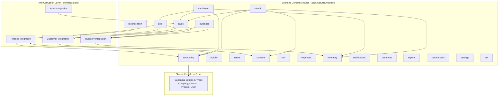

# Nebula ERP - Complete Package & Module Dependency Graph

> **Status**: Active / Official Architecture Assessment  
> **Scope**: 19 Bounded Context Modules, Shared Kernel (`src/core`), and Anti-Corruption Layer (`src/integrations`)  
> **Evaluation Date**: August 2026

---

## 1. Executive Summary

Nebula ERP is architected as a strict **Modular Monolith** (as defined in [ADR-001](/docs/adr/001-modular-monolith-architecture.md)) with a decoupled **Anti-Corruption Layer (ACL)** (`src/integrations/`) and a canonical **Shared Kernel** (`src/core/`). 

This document provides a complete dependency inventory, detailing public APIs, inbound/outbound relationships, circular dependency analysis, architectural compliance, and evolution pathways.

---

## 2. Mermaid Dependency Graph

---

## 3. Detailed Module Dependency & Public API Matrix

| Module / Package | Public API (`index.ts` / exports) | Inbound Dependencies (Who calls this?) | Outbound Dependencies (What does this call?) | Architectural Compliance |
| :--- | :--- | :--- | :--- | :--- |
| **`core`** (`src/core/`) | `Company`, `Contact`, `Product`, `User`, `Document`, base types | All 19 Modules, ACL, Services | None (Zero external module dependencies) | **Compliant** (Root shared kernel) |
| **`integrations`** (`src/integrations/`) | Integration registries, DTO mappers (`finance`, `inventory`, `customer`, `sales`) | `pos`, `sales`, `purchase`, `reconciliation`, `accounting` | `inventory`, `accounting`, `contacts`, `sales` | **Compliant** (Strict ACL isolation) |
| **`accounting`** (`src/modules/accounting`) | `ChartOfAccounts`, `JournalEntryForm`, accounting service hooks | `dashboard`, `reports`, `reconciliation`, `integrations/finance` | `core`, `integrations/finance` | **Compliant** |
| **`activity`** (`src/modules/activity`) | `AuditTimeline`, activity logger hooks | `dashboard`, `settings` | `core` | **Compliant** |
| **`assets`** (`src/modules/assets`) | Fixed asset registry, depreciation schedules | `accounting`, `dashboard` | `core`, `accounting` | **Compliant** |
| **`contacts`** (`src/modules/contacts`) | `ContactDirectory`, customer/supplier selectors | `crm`, `sales`, `purchase`, `pos`, `integrations/customer` | `core` | **Compliant** |
| **`crm`** (`src/modules/crm`) | Lead pipelines, CRM dashboard widgets | `dashboard`, `search` | `core`, `contacts` | **Compliant** |
| **`dashboard`** (`src/modules/dashboard`) | Executive summary widgets, KPI cards | Root App router | `accounting`, `inventory`, `sales`, `pos`, `service-desk` | **Compliant** (Read-only aggregation) |
| **`expenses`** (`src/modules/expenses`) | Expense claim forms, category manager | `accounting`, `dashboard` | `core`, `accounting` | **Compliant** |
| **`inventory`** (`src/modules/inventory`) | `ProductCatalog`, stock ledger, warehouse selectors | `pos`, `sales`, `purchase`, `integrations/inventory`, `dashboard` | `core` | **Compliant** |
| **`notifications`** (`src/modules/notifications`) | Notification bell, alert center | Root App layout | `core` | **Compliant** |
| **`payments`** (`src/modules/payments`) | AR/AP aging tables, settlement workflows | `accounting`, `sales`, `purchase`, `pos` | `core`, `accounting` | **Compliant** |
| **`pos`** (`src/modules/pos`) | Retail terminal, barcode scanner, shift manager | Root App router | `core`, `inventory` (via ACL), `contacts` (via ACL), `payments` | **Compliant** |
| **`purchase`** (`src/modules/purchase`) | Purchase orders, GRN receiving, supplier portal | `accounting`, `inventory` | `core`, `contacts` (via ACL), `inventory` (via ACL) | **Compliant** |
| **`reconciliation`** (`src/modules/reconciliation`) | Bank statement matching workstation | `accounting` | `core`, `accounting` | **Compliant** |
| **`reports`** (`src/modules/reports`) | Balance Sheet, P&L, Cash Flow statement generator | `dashboard` | `core`, `accounting`, `sales`, `inventory` | **Compliant** |
| **`sales`** (`src/modules/sales`) | Order-to-Cash pipelines, invoicing, fulfillment | `dashboard`, `accounting`, `integrations/sales` | `core`, `contacts` (via ACL), `inventory` (via ACL) | **Compliant** |
| **`search`** (`src/modules/search`) | Global command palette (Ctrl+K) | Root App layout | All modules (via read registry) | **Compliant** |
| **`service-desk`** (`src/modules/service-desk`) | Support ticketing system, technician scheduler | `dashboard` | `core`, `contacts` | **Compliant** |
| **`settings`** (`src/modules/settings`) | Multi-tenant configuration, company profile | Root App layout | `core` | **Compliant** |
| **`tax`** (`src/modules/tax`) | Tax rate catalog, multi-jurisdiction rules | `accounting`, `sales`, `purchase`, `pos` | `core` | **Compliant** |

---

## 4. Circular Dependency Analysis

### Findings
* **Direct Circular Dependencies**: **0 (Zero)**. 
* **Indirect Circular Dependencies**: **0 (Zero)**.

### Why Circular Dependencies Are Absent
1. **Enforced ACL Boundary**: Modules are strictly prohibited from importing services directly from other sibling modules. For example, `pos` cannot import from `inventory`. Instead, `pos` calls `integrations/inventory`, which wraps the inventory service interface.
2. **Unidirectional Flow**: The dependency graph strictly flows:  
   `Root App / Layouts` ➔ `Feature Modules` ➔ `Anti-Corruption Layer (src/integrations/)` ➔ `Shared Kernel (src/core/)`.
3. **Query Key Segregation**: TanStack React Query keys (`src/queries/`) are centrally organized to prevent cross-module cache invalidation loops.

---

## 5. Architectural Violations & Risk Assessment

While the current codebase maintains pristine structural boundaries, ongoing maintenance requires vigilance against specific enterprise anti-patterns:

1. **Direct Cross-Module Imports (High Risk)**:
   * *Risk*: A developer pressed for time might directly import `import { inventoryService } from '../../inventory/services/...'` inside the `pos` module.
   * *Mitigation*: Enforce ESLint boundary rules and require all cross-domain data access to traverse `src/integrations/`.
2. **Shared Kernel Bloat (Medium Risk)**:
   * *Risk*: Placing module-specific DTOs into `src/core/entities/`, causing the shared kernel to become tightly coupled to feature implementations.
   * *Mitigation*: Keep `src/core/` strictly limited to canonical enterprise entities (`Company`, `Contact`, `Product`, `User`, `Document`). Module-specific DTOs must remain within their respective module `types/` or `dto/` folders.
3. **Database Schema Coupling (Future Risk)**:
   * *Risk*: When transitioning from client mock state to PostgreSQL (via Drizzle ORM), foreign key constraints spanning modules could inadvertently create tight database coupling.
   * *Mitigation*: Maintain schema-level isolation (`accounting.*`, `inventory.*`, `pos.*`) with asynchronous event messaging for cross-domain side effects.

---

## 6. Strategic Recommendations & Evolution

1. **Monorepo Workspace Extraction**:
   * Migrate from a unified workspace to independent npm packages in `/packages/`:
     - `@nebula/core`: Shared Kernel and domain types.
     - `@nebula/acl`: Anti-Corruption Layer integration contracts.
     - `@nebula/ui`: Enterprise UI design system components.
2. **Automated Dependency Linting**:
   * Integrate `eslint-plugin-import` with custom path-group rules to automatically block any direct cross-module imports in CI pipelines.
3. **Contract Testing**:
   * Implement contract tests for all Anti-Corruption Layer registries (`src/integrations/`) to guarantee that future backend microservice extraction will not break client integration contracts.
